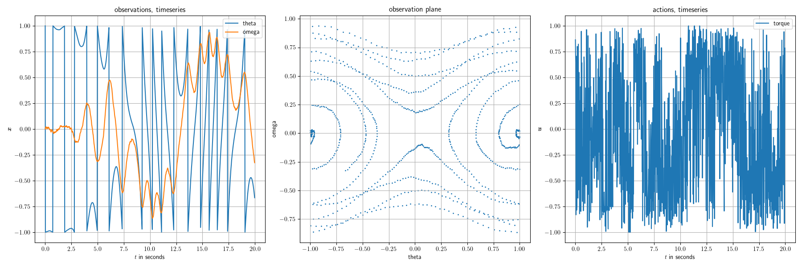

# Differentiable Model Predictive Excitation (DMPE):

This repository implements an algorithm for the excitation of systems with unknown (usually non-linear) systems.
The inner workings and lines of thought are outlined within the corresponding publication.
If you found this repository useful for your research, please cite it as:

```
@Article{Vater**TBD**,
  author  = {**TBD**},
  journal = {**TBD**},
  title   = {**TBD**},
  year    = {**TBD**},
}
```

## Structure:

The repository consists of two main folders. `eval/` contains the code used in the experiments in [Vater2024]. `dmpe/` contains the source code for the DMPE algorithm and also for the GOATS algorithms from the related work.


## Basic Usage:

To apply the algorithms onto a system, the systems structure must comply to a specific API (Naturally, this can be adapted in the future to enable easier entry. Please open an issue, if you are interested in discussing this). Example environments following this API can be found in the `exciting_environments` repository.

Using the algorithm for such an environment is as simple as:

```py
import jax.numpy as jnp
import diffrax

import exciting_environments as excenvs
from dmpe.models.models import NeuralEulerODEPendulum
from dmpe.algorithms import excite_with_dmpe, default_dmpe_parameterization


env = excenvs.make(
    env_id="Pendulum-v0",
    batch_size=1,
    action_constraints={"torque": 5},
    static_params={"g": 9.81, "l": 1, "m": 1},
    solver=diffrax.Tsit5(),
    tau=2e-2,
)

def featurize_theta(obs):
    """Transform angle information with sin() and cos()."""
    feat_obs = jnp.stack([jnp.sin(obs[..., 0] * jnp.pi), jnp.cos(obs[..., 0] * jnp.pi), obs[..., 1]], axis=-1)
    return feat_obs

# get default parameterization
exp_params, proposed_actions, loader_key, expl_key = default_dmpe_parameterization(
    env, seed=0, featurize=featurize_theta, model_class=NeuralEulerODEPendulum
)
exp_params["n_time_steps"] = 1000  # reduce to N=1000

# run excitation
observations, actions, model, density_estimate, losses, proposed_actions = excite_with_dmpe(
    env,
    exp_params,
    proposed_actions,
    loader_key,
    expl_key,
)

# visualize
from dmpe.evaluation.plotting_utils import plot_sequence
import matplotlib.pyplot as plt
import matplotlib as mpl
mpl.rcParams['text.usetex'] = True
mpl.rcParams.update({'font.size': 10})
mpl.rcParams['text.latex.preamble']=r"\usepackage{bm}\usepackage{amsmath}"

fig = plot_sequence(observations, actions, env.tau, env.obs_description, env.action_description)
plt.show()
```

